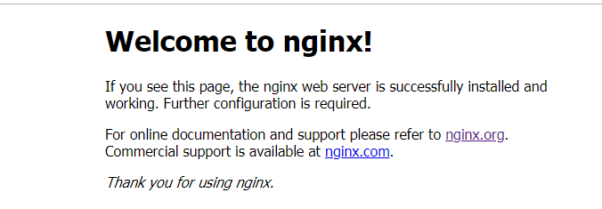

<center><h1>
    Nginx安装
    </h1></center>

# 1、安装环境

CentOs7-1804、nginx-Stable version

# 2、设置yum安装环境

在/etc/yum.repos.d/目录下面新建nginx.repo镜像源文件。

## 2、1 Stable 版本安装

Stable版本安装需要作如下配置：

```nginx
[nginx]
name=nginx repo
baseurl=http://nginx.org/packages/OS/OSRELEASE/$basearch/
gpgcheck=0
enabled=1
```

## 2、2 Mainline版本安装

Mainline版本安装需要作如下配置：

```
[nginx]
name=nginx repo
baseurl=http://nginx.org/packages/mainline/OS/OSRELEASE/$basearch
gpgcheck=0
enabled=1
```

其中OS需要替换成当前安装环境的操作系统类型，如：“rhel”或者“centos”，并且OSRELEASE使用系统的版本来替代，如：“6”或者“7”。

```
[Stable]
baseurl=http://nginx.org/packages/centos/7/$basearch
[Mainline]
baseurl=http://nginx.org/package/mainline/centos/7/$basearch
```

## 3、安装依赖

安装pcre，zlib。前者是为了重写rewrite，后者是为了gzip压缩。

```
yum -y install pcre zlib
```

# 4、安装nginx

```
yum -y install nginx 
```

# 5、启动nginx

```
nginx 
```

启动完成之后，通过打开浏览器，输入IP地址可以看看如下效果，表示nginx安装成功。

浏览器访问，http://192.168.0.73

